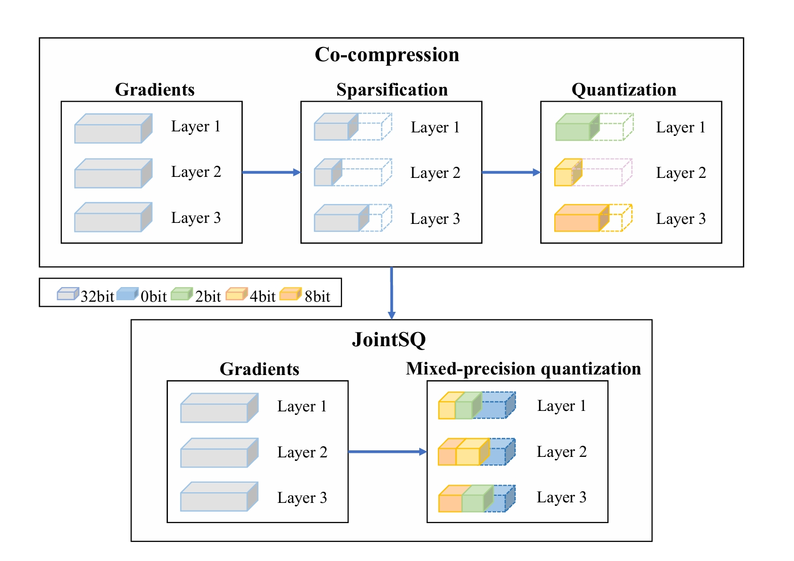

# JointSQ
 Simple Implementation of the CVPR 2024 Paper "JointSQ: Joint Sparsification-Quantization for Distributed Learning"
 Paper：https://cvpr.thecvf.com/virtual/2024/poster/31122
# Overview
  We propose Joint Sparsification Quantization (JointSQ), to address suboptimal solutions in communication-efficient distributed learning. Our approach unifies sparsification and quantization by treating sparsification as 0-bit quantization. JointSQ involves mixed-bit precision quantization for end-to-end compression. To adaptively assign bit-widths, we introduce a specially designed Multiple-Choice Knapsack Problem (MCKP) per layer with minimal computational cost.
<p align="center">
<br/>
 Figure 1. Existing Co-compression methods and our JointSQ framework. Our framework considers sparsification as 0-bit quantization and thus the two-stage process is transformed into a unified learning framework.  <br/><br/>

# Prerequisites
 The code is built with following libraries:
- Python = 3.8
- [PyTorch](https://github.com/pytorch/pytorch) = 1.8.0
- [numpy](https://github.com/numpy/numpy) = 1.22.3
- [tqdm](https://github.com/tqdm/tqdm) = 4.65.0
- pandas = 2.0.3
- ...

 # Code
  # training
   For training parameters related to learning rate, batch size, model, and distributed training, please refer to main.py for details. These parameters can be manually set via the command line. Below is an example of a run command:
   ```python
   python -m torch.distributed.run --nproc_per_node 4 --nnode 1 main.py --with_gc
```
In the models file, I have provided supported models that can be directly accessed through the command line in main.py. Please note that I have not included SimpleViT in the models. If you wish to use SimpleViT or any other model, please modify the model definition on line 344 of main.py. 
  # Compression
  In the code, I have integrated compression into the communication hook (automatically called during backpropagation). I have replicated several distributed learning compression methods and encapsulated them into various hooks. To utilize different compression methods, please modify the main.py file.
   ```python
   import communication_hook.hooks_JointSQ as myhooks
```
 # Custom compression method
 The framework proposed in this paper is highly flexible; in fact, it can be integrated as a hybrid quantization method into any distributed architecture. Furthermore, its scope of application can be customized; for instance, it can be executed per layer or per iteration, allowing for flexible adaptation based on computational capabilities. Modifications can be made at [communication_hook/hooks_JointSQ.py](communication_hook/hooks_JointSQ.py).

## Citation

If you find this useful, please cite our work as:

```
@inproceedings{xie2024jointsq,
  title={JointSQ: Joint Sparsification-Quantization for Distributed Learning},
  author={Xie, Weiying and Li, Haowei and Ma, Jitao and Li, Yunsong and Lei, Jie and Liu, Donglai and Fang, Leyuan},
  booktitle={Proceedings of the IEEE/CVF Conference on Computer Vision and Pattern Recognition},
  pages={5778--5787},
  year={2024}
}
```
